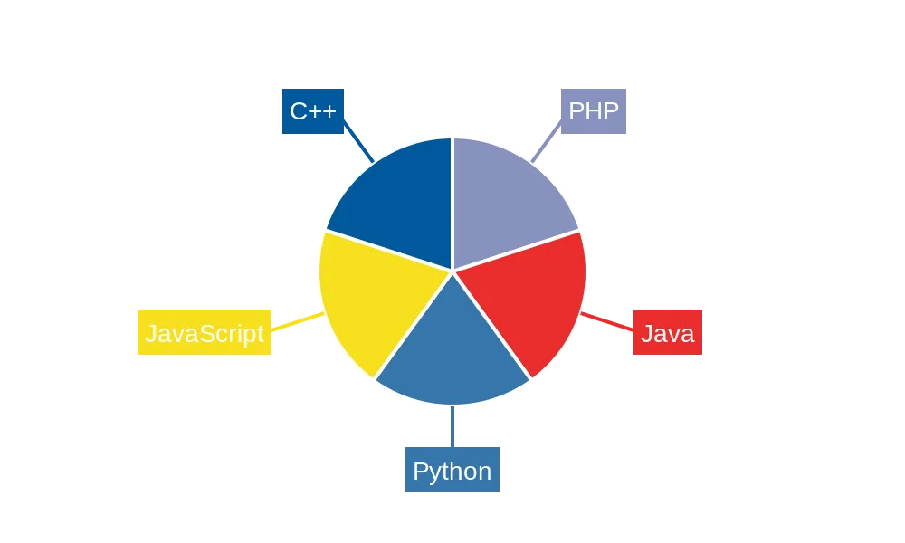

#  Hi there! I'm z13u

## 👨‍💻 About Me
- 🎯 I'm a Cybersecurity Enthusiast
- 📚 Currently learning about Network Security and Ethical Hacking
- 💡 Passionate about protecting digital assets and information
- 🤝 Looking to collaborate on security research and projects

## 🛠️ Tech Stack & Security Tools

### 💻 Programming:

    

### 🔐 Security Tools: 

* Wireshark
* Nmap
* Burp Suite
* Tool-Pentesting in Kali Linux
* And more...

### 💽 Operating Systems: 

* Linux (Ubuntu, Kali Linux)
* Windows

### 📖 Learning Platforms:

* [TryHackMe](https://tryhackme.com)
* [HackTheBox](https://www.hackthebox.com)
* [Dreamhack](https://dreamhack.io)
* [PicoCTF](https://picoctf.org)
* [CookieArena](https://cookiearena.org)
* [RootMe](https://www.root-me.org)
* [WebHacking](https://webhacking.kr)
* [CTFTime](https://ctftime.org/)

### 🎯 Areas of Interest:

* Web Application Security
* Penetration Testing
* Digital Forensics
* Web Development

## 📈 GitHub Stats

## 📊 Top Languages

## 📬 How to Reach Me

* 📧 Email: lqhieu110604@gmail.com
* 💼 LinkedIn: [quanghieula](https://www.linkedin.com/in/quanghieula)
* 🌐 Website: [zh13u.github.io](https://zh13u.github.io)

## 📂 Repositories

- 🌐 Personal Website: [zh13u.github.io](https://zh13u.github.io)
  - Built with HTML, CSS, JavaScript
  - Deployed on GitHub Pages
  - Features: [Add your website features here]

## ⭐ Fun Facts

- 🔒 Always practicing responsible disclosure
- 🎮 Love solving CTF challenges
- 🤝 Contributing to security research

---
 From [zh13u](https://github.com/zh13u)
